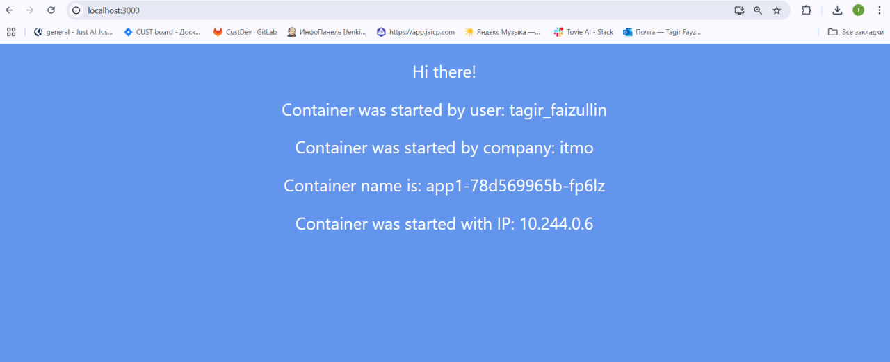

University: [ITMO](https://itmo.ru/ru/)  
Faculty: [FICT](https://fict.itmo.ru)  
Course: [Introduction to distributed technologies](https://github.com/itmo-ict-faculty/introduction-to-distributed-technologies)  
Year: 2024/2025  
Group: K4110c  
Author: Faizullin Tagir Ruslanovich\
Lab: Lab2\
Date of create: 12.12.2024\
Date of finished: 12.12.2024

## 1. Введение

###  Цель работы
Ознакомиться с типами "контроллеров" развертывания контейнеров, ознакомиться с сетевыми сервисами и развернуть свое веб-приложение

### Задание
- Необходимо создать `deployment` с 2 репликами контейнера [ifilyaninitmo/itdt-contained-frontend:master](https://hub.docker.com/repository/docker/ifilyaninitmo/itdt-contained-frontend) и передать переменные в эти реплики: `REACT_APP_USERNAME`, `REACT_APP_COMPANY_NAME`.

- Создать сервис через который у вас будет доступ на эти "поды". Выбор типа сервиса остается на ваше усмотрение.

- Запустить в `minikube` режим проброса портов и подключитесь к вашим контейнерам через веб браузер.

- Проверить на странице в веб браузере переменные `REACT_APP_USERNAME`, `REACT_APP_COMPANY_NAME` и `Container name`. Изменяются ли они? Если да, то почему?

- Проверить логи контейнеров, приложить логи в отчёт.

## 2. Ход работы
### 2.1. Создание деплоймента
Опишем деплоймент при помози yaml манифеста:
```yaml
apiVersion: apps/v1
kind: Deployment
metadata:
  name: app1
  labels:
    app: app1
spec:
  replicas: 2
  selector:
    matchLabels:
      app: app1
  template:
    metadata:
      labels:
        app: app1
    spec:
      containers:
        - name: app1
          image: ifilyaninitmo/itdt-contained-frontend:master
          env:
            - name: REACT_APP_USERNAME
              value: "tagir_faizullin"
            - name: REACT_APP_COMPANY_NAME
              value: "itmo"
          ports:
            - containerPort: 3000
              name: http
```
Здесь в `spec` мы прописываем следующие поля:
* `replicas` кол-во реплик контейнеров, которые необходимо создать.
* `selector` указываем `ReplicaSet` (множество реплик которое мы создаем деплойментом) и указываем тем самым какими подами она сможет управлять. Механизм работает как отображение ключ/значение, и для выбора конкретного пода нужно совпадение всех ключей с метками.
* `template` описываем шаблон подов.
* `env` выставляем переменные окружения внутри контейнеров по заданию это `REACT_APP_COMPANY_NAME` и `REACT_APP_USERNAME`.

### 2.2. Создание сервиса
Создать сервис, используя yaml манифест:

```yaml
apiVersion: v1
kind: Service
metadata:
  name: app1
spec:
  type: NodePort
  ports:
    - port: 3000
      targetPort: 3000
      protocol: TCP
      name: http
  selector:
    app: app1
```

Назначения полям в `ports`:
* `port` Это порт внутреннего кластерного IP службы. (Это указание на порт, который будет открыт на уровне Kubernetes для внешних запросов или для связи между сервисами внутри кластера).
* `targetPort` Это целевой порт модулей, связанных с этой службой. (То есть, запросы, поступающие на порт 3000 на уровне Kubernetes, будут перенаправлены на порт 3000 в контейнере).

### 2.3. Запуск

Запустим службу и деплоймент при помощи команд:
```
kubectl apply -f deployment.yaml
kubectl apply -f app-nodeport.yaml
```


Статус `created` означает, что деплоймент и служба были только что созданы.
Видим что поды имеют статут `RUNNING` а следовательно запущены и работают.

### 2.4. Подключение к контейнерам

Запускаем проброс портов и в браузер:
```
kubectl port-forward service/app 3000:3000
```
И после этого просмотри url по которому работает сервис.


Мы видим, что значения переменных, указанных в манифесте, передаются в приложения при этом они не меняются от контейнера к контейнеру.

### 2.5. Логи
Просмотрим логи пода

Выведем список логов и выведем логи нужного пода:


## 3. Схема


## 4. Вывод
При помощи манифестов в этой работе была создана инфраструктура, включающая деплоймент с 2 репликами приложения, в переменные которых мы передали значение itmo в качестве `REACT_APP_COMPANY_NAME` и юзернейм для `REACT_APP_USERNAME` и служба типа NodePort для перенаправления трафика в поды. Таким образом мы и смогли увидеть передаваемые значения переменных в разных контейнерах приложения.