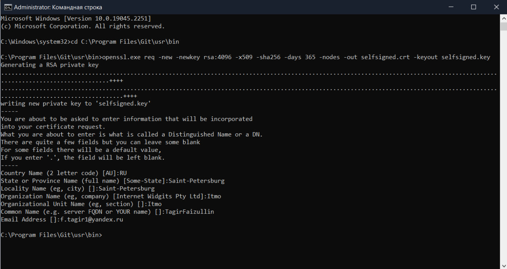
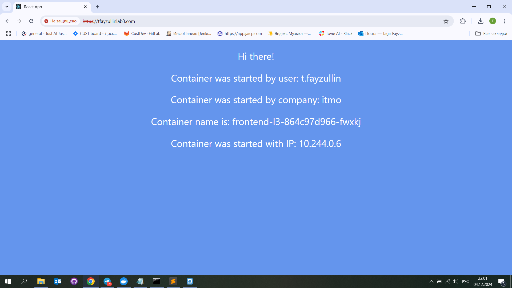

University: [ITMO](https://itmo.ru/ru/)  
Faculty: [FICT](https://fict.itmo.ru)  
Course: [Introduction to distributed technologies](https://github.com/itmo-ict-faculty/introduction-to-distributed-technologies)  
Year: 2024/2025  
Group: K4110c  
Author: Faizullin Tagir Ruslanovich\
Lab: Lab3\
Date of create: 12.12.2024\
Date of finished: 12.12.2024

### Цель работы
Познакомиться с сертификатами и "секретами" в Minikube, правилами безопасного хранения данных в Minikube.

### Задачи
- Вам необходимо создать `configMap` с переменными: `REACT_APP_USERNAME`, `REACT_APP_COMPANY_NAME`.

- Вам необходимо создать `replicaSet` с 2 репликами контейнера [ifilyaninitmo/itdt-contained-frontend:master](https://hub.docker.com/repository/docker/ifilyaninitmo/itdt-contained-frontend) и используя ранее созданный `configMap` передать переменные `REACT_APP_USERNAME`, `REACT_APP_COMPANY_NAME` .

- Включить `minikube addons enable ingress` и сгенерировать TLS сертификат, импортировать сертификат в minikube.

- Создать ingress в minikube, где указан ранее импортированный сертификат, FQDN по которому вы будете заходить и имя сервиса который вы создали ранее.

> Если вы делаете эту работу на Windows/macOS для доступа к ingress вам необходимо использовать команду `minikube tunnel` к созданному ingress.
> Если вы делаете эту работу на Windows/macOS для доступа к ingress вам необходимо в hosts добавить ip address localhost и ваш FQDN. Если установлен Linux, то нужно указывать minikube ip.

- В `hosts` пропишите FQDN и IP адрес вашего ingress и попробуйте перейти в браузере по FQDN имени.

- Войдите в веб приложение по вашему FQDN используя HTTPS и проверьте наличие сертификата.

> Обычно в браузере это маленький замочек рядом с FQDN сайта, нажмите на него и сделайте скриншот с информацией.

## 1. Ход работы
Ниже представлен пошаговый ход работы

### 1.1 Создане манифеста

Для выполнения работы нам необходимо описать несколько сущностей манифеста:

* `ConfigMap`, через который мы будем передавать нужные переменные.
* `Deployment`, который мы будем использовать вместо ReplicaSet.
* `Service`, через который будем получать доступ к подам.
* `Ingress`, через сущность будем обрабатывать внешние запросы к кластеру.

Опишем `ConfigMap`:
```yaml
apiVersion: v1
kind: ConfigMap
metadata:
 name: config
data:
 REACT_APP_USERNAME: "t.fayzullin"
 REACT_APP_COMPANY_NAME: "itmo"
```

Опишем `Deployment`:
```yaml
apiVersion: apps/v1
kind: Deployment
metadata:
 name: frontend-l3
spec:
 replicas: 2
 selector:
  matchLabels:
   app: frontend-l3
 template:
  metadata:
   labels:
    app: frontend-l3
  spec:
   containers:
    - name: frontend-l3
      image: ifilyaninitmo/itdt-contained-frontend:master
      ports:
       - containerPort: 3000
         name: http
      envFrom:
       - configMapRef:
          name: config
```
Здесь мы используем секцию `envFrom` с указанием имени ConfigMap. 

Опишем `Service`:
```yaml
apiVersion: v1
kind: Service
metadata:
 name: app1
spec:
 type: NodePort
 ports:
  - port: 3000
    targetPort: 3000
    protocol: TCP
    name: http
 selector:
  app: frontend-l3

```
Секции сервиса не меняются и остаются такими же как и в ЛР2.

Опишем `Ingress`:
```yaml
apiVersion: networking.k8s.io/v1
kind: Ingress
metadata:
 name: ing-l3
spec:
 tls:
  - hosts:
     - tfayzullinlab3.com
    secretName: secret-tls
 rules:
  - host: tfayzullinlab3.com
    http:
     paths:
      - path: /
        pathType: Prefix
        backend:
         service:
          name: app1
          port:
           name: http

```
В поле ingress мы указываем следующие секции:
* Секция `tls` указывает, откуда мы получаем секреты (значение получаем из отдельно созданного файла)
* Секция `rules` указываем правила обработки запросов. 
 `PathType: Prefix` вместе с `path: /` задают условие, что под указанные правила подпадают все пути, по которым мы можем обращаться к данному приложению.
Поле `backend` позволяет указать, на какой конкретно сервис надо направить такой запрос.

### 1.2 Подготовка среды
Запустим `minikube` с аддоном `ingres`.

### 1.3 Создание сертификата
Также нам необходимо создать сертификат. 

Сертификат представляет собой технологию безопасности, 
с помощью которой шифруется связь между браузером и сервером. 
Благодаря такому сертификату сложнее украсть или подменить данные пользователей. 
SSL/TLS-сертификат устанавливают на сервер. 
Помимо шифрования всех коммуникаций, 
с его помощью можно проверить подлинность веб-сайта. 
Теперь создается TLS сертификат. 

* **SSL** – Secure Sockets Layer.
* **TLS** – Transport Layer Security.  

Сделаем это средствами openssl с помощью команды:
```bash
$ openssl req -new -newkey rsa:4096 -x509 -sha256 -days 36
5 -nodes -out selfsigned.crt -keyout selfsigned.key
```

При помощи этой команды мы указываем сразу несколько опций:
* `-new` указывает, что нам нужен новый сертификат.
* `-newkey rsa:4096` мы указываем, что у нас будет ключ длиной 4096 бит.
* `-x509` указывает, что мы создаем сертификат по стандарту X.509
* `-sha256` сгенерирует сертификат с использованием `sha256` суммы
* `-days 365` указывает, что срок валидности этого сертификата составит 365 дней
* `-nodes` позволит не зашифровывать приватный ключ парольной фразой
* `-out file.crt` описывает, куда будет помещен полученный сертификат
* `-keyout file.key` описывает, куда будет помещен полученный ключ

После чего нам нужно будет ответить на вопросы для создания сертификата:



и добаавим сертификаты в minikube:
```bash
$ kubectl create secret tls secret-tls --key="selfsigned.key" --cert="selfsigned.crt"
```

### 1.4 Подготовка кластера
Применим наши манифесты и откроем тоннель:
```bash
kubectl apply -f configmap.yaml
kubectl apply -f deployment.yaml
kubectl apply -f service.yaml
kubectl apply -f ingress.yaml

minikube tunnel
```

Можем проверить зайдя по url: tfayzullinlab3.com

Так как мы сами подписали этот сертификт, то не все браузеры позволят открыть сайт с таким сомнительным сертификатом.


### 1.4 Диаграмма развертывания:


