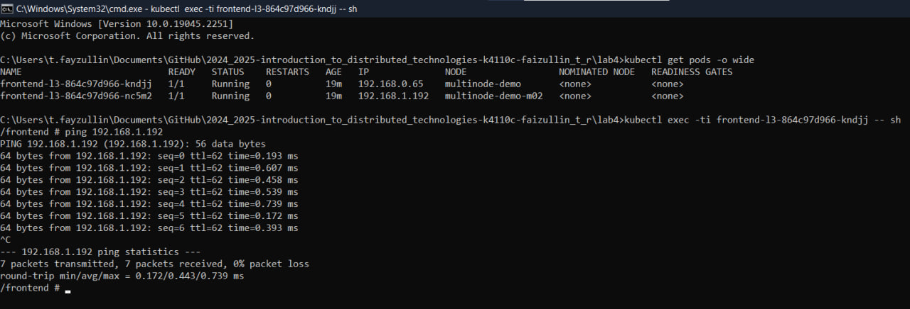

University: [ITMO](https://itmo.ru/ru/)  
Faculty: [FICT](https://fict.itmo.ru)  
Course: [Introduction to distributed technologies](https://github.com/itmo-ict-faculty/introduction-to-distributed-technologies)  
Year: 2024/2025  
Group: K4110c  
Author: Faizullin Tagir Ruslanovich\
Lab: Lab4\ 
Date of create: 12.12.2024\  
Date of finished: 12.12.2024 

### Цель работы
Познакомиться с CNI Calico и функцией `IPAM Plugin`, изучить особенности работы CNI и CoreDNS.

### Задание
- Запустить minikube c плагином `CNI=calico` и режимом работы `Multi-Node Clusters` одновременно, развернуть 2 ноды;
- Проверить работу CNI плагина Calico, количество нод;
- Указать `label` по признаку стойки или географического расположение (на свое усмотрение);
- Разработать манифест для Calico, который на основе указанных меток назначает IP адреса подам исходя из пулов IP адресов в манифесте.
- Создать деплоймент с двумя репликами контейнера [ifilyaninitmo/itdt-contained-frontend:master](https://hub.docker.com/repository/docker/ifilyaninitmo/itdt-contained-frontend) и передать переменные в эти реплики: `REACT_APP_USERNAME`, `REACT_APP_COMPANY_NAME`;
- Создать сервис, через который будет доступ в поды;
- Запустить в `minikube` режим проброса портов и подключиться к контейнерам через веб браузер;
- Проверить переменные `Container name` и `Container IP`. Если меняются, объяснить почему;
- Зайти в любой под и попробовать попинговать поды используя FQDN соседнего пода.


## 1. Ход работы
Ниже представлен пошаговый ход работы

### 1.1 Настройка среды
`minikube` в данной работе запускается с помощью следующей команды:
```bash
minikube start --network-plugin=cni --cni=calico --nodes 2 -p multinode-demo
```
После успешного запуска проверим, что создалось действительно две ноды с помощью команды
```bash
kubectl get nodes
```
Также не лишним будет проверить количество подов `calico`.
Их число должно совпадать с количеством нод.
```bash
kubectl get pods -l k8s-app=calico-node -A
```


### 1.3 Пометка нод

Каждую ноду в соответствии с заданием пометим по признаку стойки.

В соответствии с заданием помечается каждая нода по географическому расположению

Для назначения IP адресов в Calico необходимо написать манифест для IPPool ресурса.

С помощью IPPool можно создать IP-pool (блок IP-адресов), который выделяет IP-адреса только для узлов с определенной меткой (label).

С помощью следующей команды, назначаются метки узлам :

Пометка делается с помощью команды
```bash
kubectl label nodes multinode-demo ra=a01
kubectl label nodes multinode-demo-m02 ra=a02
```

## 2. Настройка calico
Далее из официальной документации Calico берется шаблон манифеста IPPool, прикреплен в директории - [ippool.yaml](ippool.yaml)
В его спеке есть следующие поля:
- `ipipMode` позволяет настроить режим IP-туннелирования.
  Судя по документации, есть два режима:
    - Режим `Always` включает инкапсуляцию пакетов для всего трафика от Calico-хоста к другим Calico-контейнерам и всем VM, имеющим IP в заданном IPPool.
    - Режим `CrossSubnet` включает инкапсуляцию только для того трафика, который ходит между сетями.
      Calico рекомендует использовать режим `CrossSubnet` в случае `ipipMode`, так как это уменьшит накладные расходы на инкапсуляцию.
      Но так как у нас работа маленькая, то можно и использовать режим `Always`.
- `natOutgoing` позволяет разрешить подам ходить во внешнюю сеть с помощью `NAT`.
  В данной работе эта настройка не особо играет роли, так как нам не требуется ходить во внешний интернет и наши поды не развернуты на железках.

- `nodeSelector` позволяет определить, какие ноды должны получать адрес из этого пула. В данном конкретном примере все ноды, находящиеся в "нулевой стойке", будут получать IP из этого пула.

Проверим у calico дефолтный ippool:
```bash
calicoctl get ippool -o wide --allow-version-mismatch
```
И удаляем его, заменяя на нашу конфигурацию. Проверяем созданные пулы:


## 3. Deployment и Service

И теперь мы создаем деплоймент с 2 репликами, NodePort и подключаем configMap как в предыдущих ЛР.

```bash
kubectl expose deployments lab4-deployment --type=NodePort --port=3000
```
И теперь пробросим порты
```bash
kubectl port-forward lab4-deployment 3000:3000
```
и переходим по локальному хосту на порт:


## 4. Ping подов
Сначала перейдем в управление контейнера и пропишем команду ping <ip-адрес>
```bash
kubectl exec -ti lab4-deployment-76db7c9f5c-tcf6x -- sh
```
Результат:



### 5. Диаграмма развертывания


